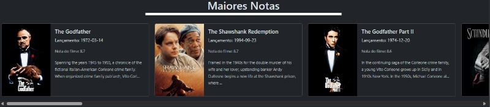
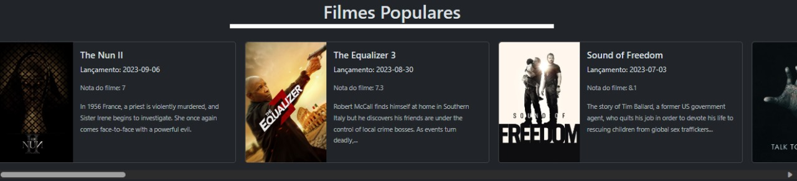

# ProjetoMovieList2.0

Projeto de lista de filme com vite+react, bootstrap e api do TMDB

## O projeto faz a requisição de filmes lançamentos

    

## Filmes com maiores notas

    

## Filmes populares

    

